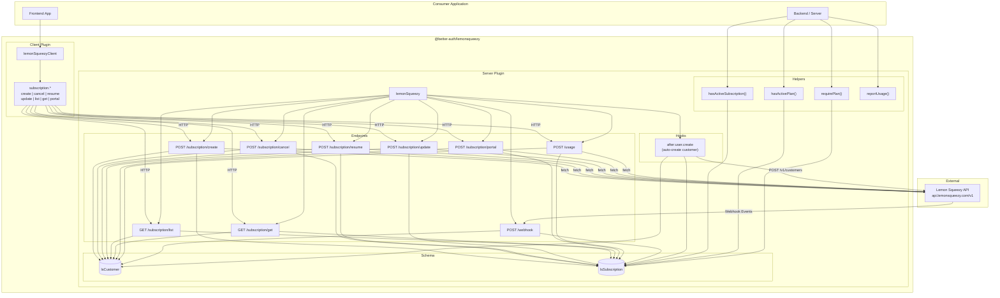
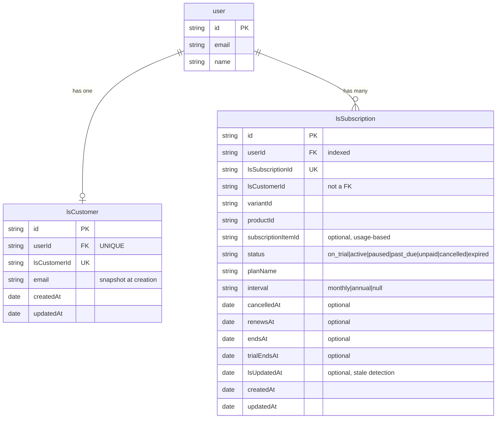
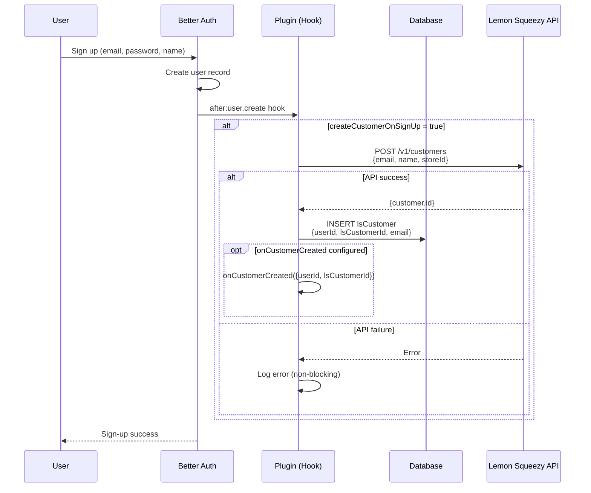
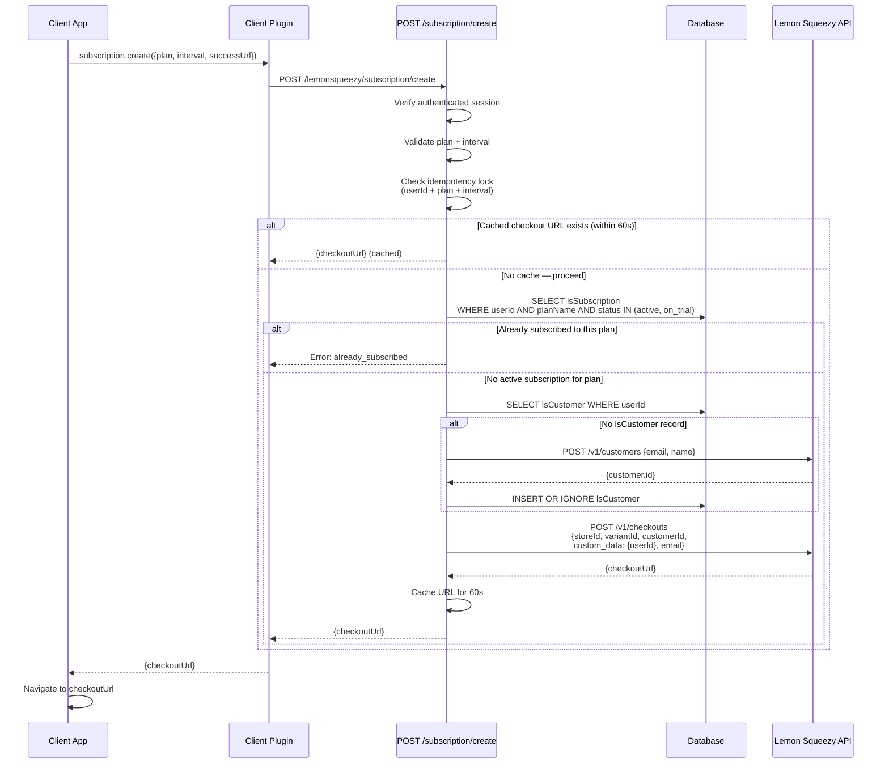
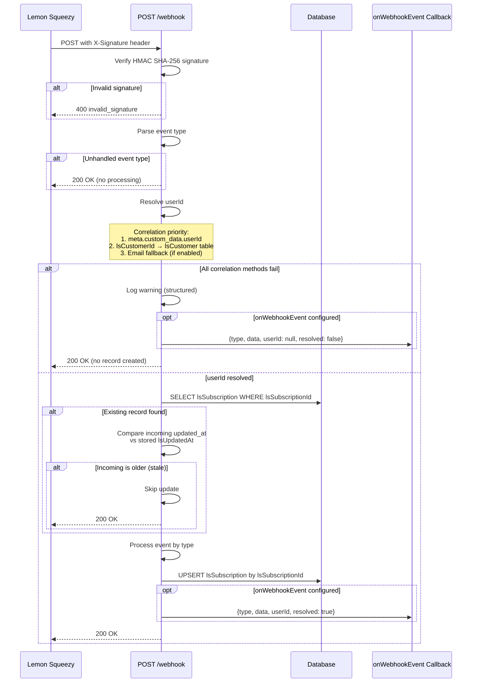
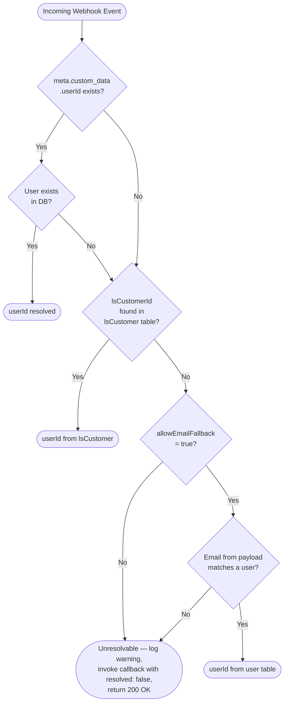
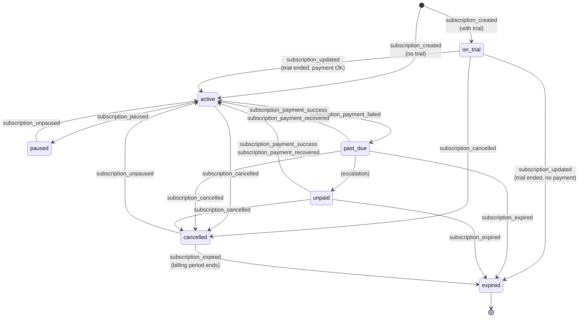
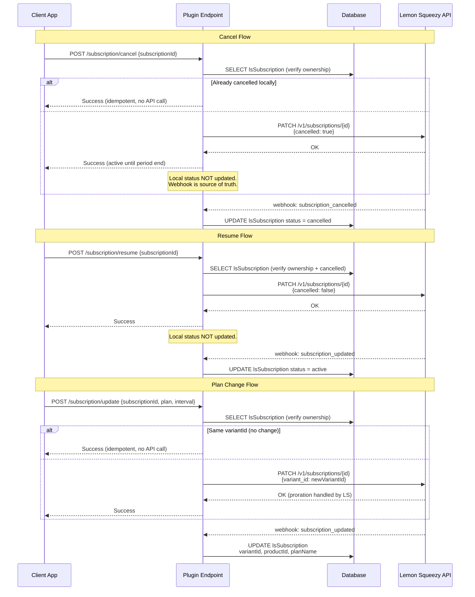
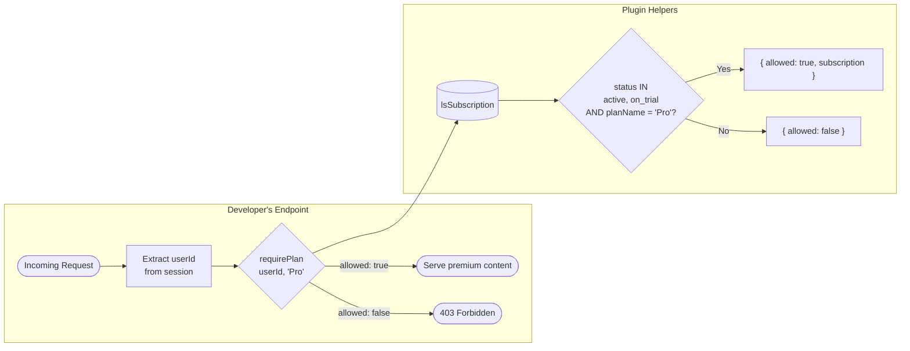

# PRD: Better Auth Lemon Squeezy Plugin

## Introduction

A Better Auth plugin (`@better-auth/lemonsqueezy`) that integrates Lemon Squeezy subscription and payment management into Better Auth. The plugin links authenticated users to Lemon Squeezy customers, syncs subscription state via webhooks, provides checkout and billing portal flows, and enables plan-based access control — all as a drop-in plugin published to npm.

This follows the same architectural pattern as the existing `@better-auth/stripe` plugin, adapted for the Lemon Squeezy API and its Merchant of Record model.

## Architecture & Flow Diagrams

### Plugin Architecture Overview

### Database Schema

### Sign-Up with Auto Customer Creation

### Checkout / Subscription Creation Flow

### Webhook Processing Flow

### Webhook User Correlation

### Subscription Lifecycle State Machine

### Cancel / Resume / Update Flow (Webhook-Driven Status)

### Access Control Flow

## Goals

- Provide a zero-config drop-in plugin for Better Auth that handles Lemon Squeezy integration
- Automatically create Lemon Squeezy customers when users sign up
- Sync subscription lifecycle events (created, updated, paused, resumed, expired, cancelled) via webhooks
- Enable plan-based access gating so developers can restrict features by subscription plan
- Provide client-side helpers for checkout, plan upgrades/downgrades, cancellation, and billing portal
- Support usage-based billing tracking
- Publish as `@better-auth/lemonsqueezy` on npm with full TypeScript support

## User Stories

### US-001: Plugin Skeleton and Configuration
**Priority:** 1
**Description:** As a developer, I need the base plugin structure with configuration options so I can install and configure the Lemon Squeezy integration.

**Acceptance Criteria:**
- [ ] Plugin exports a `lemonSqueezy()` server function and `lemonSqueezyClient()` client function
- [ ] Plugin accepts configuration: `apiKey`, `storeId`, `webhookSecret`, `createCustomerOnSignUp` (boolean), `onCustomerCreated` (optional async callback receiving `{ userId, lsCustomerId }`), `onWebhookEvent` (optional async callback — see US-004 for signature), `subscription.enabled`, `subscription.plans` (array of plan definitions), `defaultSuccessUrl` (string, optional — used as fallback when client omits `successUrl` on checkout), `defaultCancelUrl` (string, optional — used as fallback when client omits `cancelUrl` on checkout), `allowEmailFallback` (boolean, defaults to `true` — when `false`, disables email-based webhook correlation entirely, only using `meta.custom_data.userId` and `lsCustomerId` lookup; recommended for security-sensitive deployments where email reuse or change could link a subscription to the wrong user)
- [ ] Each plan definition includes: `name` (string), `productId` (string), `intervals` (object mapping billing intervals to variant IDs, e.g., `{ monthly: "variant_123", annual: "variant_456" }`) — supports monthly and annual in v1, extensible for future intervals
- [ ] Plugin registers with Better Auth using `id: "lemonsqueezy"`
- [ ] TypeScript types are exported for all config options
- [ ] Typecheck passes

### US-002: Database Schema — Subscription and Customer Tables
**Priority:** 1
**Description:** As a developer, I need database tables to persist Lemon Squeezy customer and subscription data so it survives across sessions and server restarts.

**Acceptance Criteria:**
- [ ] Plugin defines a `lsCustomer` schema table with fields: `userId` (string, references user.id, indexed, **unique** — enforced at the database level to prevent duplicate customers from concurrent sign-up + checkout race conditions), `lsCustomerId` (string, unique), `email` (string — snapshot of user email at customer creation time, used as last-resort correlation point for webhooks; known limitation: not updated when user changes email — see Technical Considerations), `createdAt` (date), `updatedAt` (date)
- [ ] Plugin defines a `lsSubscription` schema table with fields: `userId` (string, references user.id, indexed), `lsSubscriptionId` (string, unique), `lsCustomerId` (string — stored independently, not a foreign key to `lsCustomer`; this allows subscriptions created via webhook-only flow to exist without a corresponding `lsCustomer` record), `variantId` (string), `productId` (string), `subscriptionItemId` (string, optional — only populated for usage-based plans, stored on `subscription_created` from `data.attributes.first_subscription_item.id`), `status` (string — one of: `on_trial`, `active`, `paused`, `past_due`, `unpaid`, `cancelled`, `expired`), `planName` (string), `interval` (string, optional — `"monthly"`, `"annual"`, or `null` if the variant ID does not match any configured plan interval; resolved from the variant ID against configured plans at creation/update time, logs a warning to server logs on mismatch), `cancelledAt` (date, optional), `renewsAt` (date, optional), `endsAt` (date, optional), `trialEndsAt` (date, optional), `lsUpdatedAt` (date, optional — the `updated_at` timestamp from the Lemon Squeezy payload, used for stale event detection), `createdAt` (date), `updatedAt` (date)
- [ ] Both `userId` index fields support efficient lookup for access control helpers and subscription list queries
- [ ] **Cross-table query note:** `lsSubscription.lsCustomerId` is intentionally not a foreign key to `lsCustomer`. Consumers who need to join across both tables should use `userId` as the join key (present on both tables), not `lsCustomerId`. This is because subscriptions created via webhook-only flow may have an `lsCustomerId` with no corresponding `lsCustomer` record.
- [ ] Better Auth migration system picks up the new tables
- [ ] Typecheck passes

### US-003: Auto-Create Lemon Squeezy Customer on Sign-Up
**Priority:** 2
**Description:** As a developer, I want the plugin to automatically create a Lemon Squeezy customer when a user signs up so that the user is ready for checkout without extra steps.

**Acceptance Criteria:**
- [ ] When `createCustomerOnSignUp: true`, plugin hooks into the `after` phase of user creation
- [ ] Calls Lemon Squeezy API `POST /v1/customers` with the user's email and name
- [ ] Stores the returned `customer.id` in the `lsCustomer` table linked to the user
- [ ] If `onCustomerCreated` callback is configured, invokes it with `{ userId, lsCustomerId }` after successful creation (for developers who need to sync customer data to external systems)
- [ ] If the API call fails, logs the error but does not block sign-up
- [ ] Race condition note: the checkout flow (US-005) must handle the case where no `lsCustomer` record exists yet by creating the customer on-demand as a fallback
- [ ] Typecheck passes

### US-004: Webhook Endpoint for Subscription Events
**Priority:** 2
**Description:** As a developer, I need a webhook endpoint that receives and verifies Lemon Squeezy events so subscription state stays in sync.

**Acceptance Criteria:**
- [ ] Plugin registers a `POST /lemonsqueezy/webhook` endpoint
- [ ] Endpoint verifies the webhook signature using the configured `webhookSecret` and the `X-Signature` header (HMAC SHA-256)
- [ ] Handles events: `subscription_created`, `subscription_updated`, `subscription_paused`, `subscription_unpaused`, `subscription_cancelled`, `subscription_expired`, `subscription_payment_success`, `subscription_payment_failed`, `subscription_payment_recovered`, `subscription_payment_refunded`
- [ ] Note on naming: Lemon Squeezy emits `subscription_unpaused` (not `subscription_resumed`). The plugin must listen for `subscription_unpaused` as the actual event name. Internally and in the `onWebhookEvent` callback, the original event name is preserved as-is.
- [ ] Note: `subscription_plan_changed` is not a distinct Lemon Squeezy event — plan changes arrive as `subscription_updated` with changed `variant_id`/`product_id` fields. The handler must detect variant changes within `subscription_updated` and update `variantId`, `productId`, and `planName` accordingly.
- [ ] Unhandled event types (e.g., `order_created`) are acknowledged with 200 OK but not processed
- [ ] **Stale event detection:** Before applying any status or field update, compare the incoming event's `data.attributes.updated_at` against the stored `lsUpdatedAt` on the existing record. If the incoming timestamp is older than the stored value, skip the update and return 200 OK (the record already reflects a newer state). This prevents out-of-order webhook delivery from overwriting newer data (e.g., a late-arriving `subscription_cancelled` overwriting a `subscription_updated` from a resume).
- [ ] **Unresolvable user:** If all three correlation methods fail (no `meta.custom_data.userId`, no `lsCustomerId` match in `lsCustomer` table, no email match in user table), log a warning with the `lsSubscriptionId` and `lsCustomerId` from the event, and return 200 OK without processing. Do not create orphaned records. The `onWebhookEvent` callback is still invoked (if configured) with a `{ resolved: false }` flag so developers can handle this case (e.g., manual reconciliation).
- [ ] On `subscription_created`: upserts a record in `lsSubscription` linked to the user. Correlation priority: (1) `meta.custom_data.userId` from checkout, (2) `lsCustomerId` lookup in `lsCustomer` table, (3) email fallback matching user table. Stores `subscriptionItemId` from `data.attributes.first_subscription_item.id` if present (needed for usage-based billing). Upsert by `lsSubscriptionId` to ensure idempotency on webhook retries. If the user already has an active subscription for the same plan name (resolved from variant/product), the `onWebhookEvent` callback receives an additional `duplicatePlan: true` flag so developers can detect out-of-band subscription creation (e.g., via the Lemon Squeezy dashboard) and handle it as needed.
- [ ] On `subscription_updated`: updates `status`, `renewsAt`, `endsAt` fields. If `variant_id` or `product_id` changed, also updates `variantId`, `productId`, and `planName` (resolved from configured plans). Uses upsert by `lsSubscriptionId` for idempotency.
- [ ] On `subscription_paused`: updates status to `paused`. Uses upsert by `lsSubscriptionId` for idempotency.
- [ ] On `subscription_unpaused`: updates status to `active`. Uses upsert by `lsSubscriptionId` for idempotency. (Note: Lemon Squeezy's actual event name is `subscription_unpaused`, not `subscription_resumed`.)
- [ ] On `subscription_cancelled`: updates `status` to `cancelled`, sets `cancelledAt` to the current timestamp (or `data.attributes.cancelled_at` from the payload if present), and updates `endsAt` from `data.attributes.ends_at`. Uses upsert by `lsSubscriptionId` for idempotency.
- [ ] On `subscription_expired`: updates `status` to `expired` and `endsAt` accordingly. Uses upsert by `lsSubscriptionId` for idempotency.
- [ ] On `subscription_payment_success`: updates status to `active` only if current status is `past_due` or `unpaid` (preserves `on_trial` status for payments during trial, and preserves `cancelled` status since cancellation should take precedence over a recovered payment — the user explicitly chose to cancel)
- [ ] On `subscription_payment_failed`: updates status to `past_due` only if current status is `active` (preserves `on_trial` status since Lemon Squeezy does not charge during trial, and preserves `cancelled` status since a payment failure after cancellation should not move the status backwards to `past_due`)
- [ ] On `subscription_payment_recovered`: updates status to `active` only if current status is `past_due` or `unpaid` (same guard as `subscription_payment_success` — preserves `on_trial` and `cancelled` statuses)
- [ ] On `subscription_payment_refunded`: does not change subscription status (refunds do not affect subscription state in Lemon Squeezy's model — the subscription remains active until cancelled/expired). The `onWebhookEvent` callback is invoked so developers can handle refund-specific logic (e.g., logging, notifications, or manual access revocation).
- [ ] Returns 200 OK after processing
- [ ] Returns 400 for invalid signature
- [ ] Webhook endpoint must be excluded from CSRF protection (raw body is needed for signature verification)
- [ ] Plugin exposes an `onWebhookEvent` callback in config for developers to run custom logic on any event. Callback signature: `onWebhookEvent(event: { type: string, data: Record<string, any>, userId: string | null, resolved: boolean })` where `type` is the Lemon Squeezy event name (e.g., `"subscription_created"`), `data` is the raw webhook payload `data` object, `userId` is the resolved user ID (or `null` if unresolvable), and `resolved` indicates whether user correlation succeeded. Return value is ignored. Payment events (`subscription_payment_*`) do not create or update subscription records directly — they only trigger conditional status updates and invoke this callback.
- [ ] Typecheck passes

### US-005: Checkout / Create Subscription Endpoint
**Priority:** 3
**Description:** As a user, I want to subscribe to a plan so I can access premium features.

**Acceptance Criteria:**
- [ ] Plugin registers a `POST /lemonsqueezy/subscription/create` endpoint (requires authenticated session)
- [ ] Accepts `plan` (string matching a configured plan name), optional `interval` (string — `"monthly"` or `"annual"`, defaults to the first key in the plan's `intervals` object — e.g., if a plan only defines `{ annual: "variant_456" }`, it defaults to `"annual"` rather than failing with `"invalid_interval"`), `successUrl` (string, optional if `defaultSuccessUrl` is configured), `cancelUrl` (string, optional if `defaultCancelUrl` is configured). If neither client-provided nor config default is available, returns an error with code `"missing_url"`.
- [ ] If no `lsCustomer` record exists for the user, creates a Lemon Squeezy customer on-demand before generating the checkout (handles race condition with async sign-up customer creation from US-003). Uses insert-or-ignore semantics against the `userId` unique constraint to prevent duplicate customer creation under concurrency.
- [ ] **Idempotency:** Derives an idempotency key from `userId + plan + interval`. Uses an in-memory lock per key: if a checkout request is already in-flight for the same key, subsequent requests wait for the first to complete and return its result. After resolution, the checkout URL is cached for 60 seconds so immediate retries return the cached URL without a new API call. The lock ensures concurrent requests (double-clicks, rapid retries) never create duplicate checkouts, even when the first request is still pending.
- [ ] Generates a Lemon Squeezy checkout URL using the Lemon Squeezy API with the variant ID resolved from `plan.intervals[interval]`
- [ ] Passes the `lsCustomerId` in the checkout payload (`checkout_data.custom.customer_id`) to link the checkout to the existing Lemon Squeezy customer and prevent duplicate customer creation
- [ ] Pre-fills checkout with the user's email and passes `userId` in checkout custom data for webhook correlation
- [ ] Returns the checkout URL to the client (does not redirect — consumer decides navigation strategy)
- [ ] If user already has an active subscription for this plan, returns an error
- [ ] Typecheck passes

### US-006: Client-Side Plugin with Subscription Methods
**Priority:** 3
**Description:** As a developer, I want client-side helpers to manage subscriptions from my frontend.

**Acceptance Criteria:**
- [ ] `lemonSqueezyClient()` adds methods to the auth client: `subscription.create()`, `subscription.cancel()`, `subscription.resume()`, `subscription.update()`, `subscription.list()`, `subscription.get()`, `subscription.portal()`. Note: `subscription.update()`, `subscription.list()`, and `subscription.get()` depend on server endpoints defined in US-009 (priority 4) and US-010 (priority 4) respectively — the client type definitions are included at priority 3 but these methods will only function once the server endpoints are implemented.
- [ ] `subscription.create({ plan, interval?, successUrl?, cancelUrl? })` calls the create endpoint and returns the checkout URL (consumer decides how to navigate — redirect, new tab, iframe, etc.). `successUrl` and `cancelUrl` are optional if server-side defaults are configured.
- [ ] `subscription.cancel({ subscriptionId })` calls the cancel endpoint
- [ ] `subscription.resume({ subscriptionId })` calls the resume endpoint
- [ ] `subscription.update({ subscriptionId, plan, interval? })` calls the update endpoint
- [ ] `subscription.list()` returns all subscriptions for the current user
- [ ] `subscription.get({ subscriptionId })` returns a single subscription by ID for the current user
- [ ] `subscription.portal({ subscriptionId })` calls the portal endpoint and returns the portal URL (consumer decides how to navigate)
- [ ] All methods are fully typed with TypeScript
- [ ] Typecheck passes

### US-007: Cancel Subscription Endpoint
**Priority:** 3
**Description:** As a user, I want to cancel my subscription so I can stop being billed.

**Acceptance Criteria:**
- [ ] Plugin registers a `POST /lemonsqueezy/subscription/cancel` endpoint (requires authenticated session)
- [ ] Accepts `subscriptionId` (string)
- [ ] Verifies the subscription belongs to the authenticated user
- [ ] **Idempotency:** If the subscription is already in `cancelled` status locally (pending period end), returns success without making another API call. This prevents duplicate cancel requests from causing upstream errors.
- [ ] Calls Lemon Squeezy API `PATCH /v1/subscriptions/{id}` with `{ cancelled: true }` to cancel (Lemon Squeezy cancels at period end, not immediately)
- [ ] Does NOT update local `lsSubscription` status — the webhook (`subscription_cancelled` / `subscription_updated`) is the source of truth for status changes
- [ ] Returns success response with a note that the subscription remains active until the end of the billing period
- [ ] Typecheck passes

### US-008: Resume Subscription Endpoint
**Priority:** 3
**Description:** As a user, I want to resume a cancelled subscription before it expires.

**Acceptance Criteria:**
- [ ] Plugin registers a `POST /lemonsqueezy/subscription/resume` endpoint (requires authenticated session)
- [ ] Accepts `subscriptionId` (string)
- [ ] Verifies the subscription belongs to the authenticated user and status is `cancelled`
- [ ] **Idempotency:** If the subscription is already in `active` status locally, returns success without making another API call.
- [ ] Calls Lemon Squeezy API `PATCH /v1/subscriptions/{id}` with `cancelled: false`
- [ ] Does NOT update local `lsSubscription` status — the webhook (`subscription_updated`) is the source of truth for status changes
- [ ] Returns success response
- [ ] Typecheck passes

### US-009: Update Subscription (Change Plan) Endpoint
**Priority:** 4
**Description:** As a user, I want to upgrade or downgrade my plan so I get the features I need.

**Acceptance Criteria:**
- [ ] Plugin registers a `POST /lemonsqueezy/subscription/update` endpoint (requires authenticated session)
- [ ] Accepts `subscriptionId` (string), `plan` (string — target plan name), optional `interval` (string — `"monthly"` or `"annual"`)
- [ ] Verifies the subscription belongs to the authenticated user
- [ ] **Idempotency:** If the subscription's current `variantId` already matches the target variant (same plan + interval), returns success without making an API call.
- [ ] Calls Lemon Squeezy API `PATCH /v1/subscriptions/{id}` with the new `variant_id`
- [ ] Lemon Squeezy handles proration automatically
- [ ] Does NOT update local `lsSubscription` record — the webhook (`subscription_updated`) is the source of truth for plan changes (note: `subscription_plan_changed` is not a distinct Lemon Squeezy event; plan changes arrive as `subscription_updated`)
- [ ] Returns success response
- [ ] Typecheck passes

### US-010: List Subscriptions Endpoint
**Priority:** 4
**Description:** As a developer, I need an API to fetch all subscriptions for the current user so I can display billing status in the UI.

**Acceptance Criteria:**
- [ ] Plugin registers a `GET /lemonsqueezy/subscription/list` endpoint (requires authenticated session)
- [ ] Returns all `lsSubscription` records for the authenticated user (no pagination in v1 — users are expected to have a small number of subscriptions). Response shape: `{ subscriptions: [...], cursor: null }` — the `cursor` field is reserved for v2 pagination but always returns `null` in v1. The endpoint accepts an optional `cursor` query parameter (ignored in v1) so clients can adopt the pagination-ready shape from day one.
- [ ] Includes `status`, `planName`, `renewsAt`, `endsAt`, `trialEndsAt`, `createdAt`
- [ ] Plugin registers a `GET /lemonsqueezy/subscription/get` endpoint (requires authenticated session) that accepts `subscriptionId` (string) as a query parameter and returns a single `lsSubscription` record
- [ ] Verifies the subscription belongs to the authenticated user. Returns `"subscription_not_found"` or `"not_owner"` errors as appropriate
- [ ] Typecheck passes

### US-011: Plan-Based Access Control Helpers
**Priority:** 5
**Description:** As a developer, I want to gate features based on the user's subscription plan so I can enforce my pricing tiers.

**Acceptance Criteria:**
- [ ] Plugin exports a `hasActiveSubscription(userId)` helper that returns `true` if the user has any subscription with status `active` or `on_trial`
- [ ] Plugin exports a `hasActivePlan(userId, planName)` helper that returns `true` if the user has an active subscription matching the given plan
- [ ] Plugin exposes a `requirePlan(userId, planName)` standalone function that developers call in their endpoint logic to verify the user has the required plan (returns `{ allowed: boolean, subscription? }`) — not a middleware/hook, to keep it simple and testable for v1
- [ ] Helpers query the local `lsSubscription` table (no API call to Lemon Squeezy)
- [ ] All helpers accept `userId` (string) — extracting `userId` from a session or request context is the consumer's responsibility. This keeps the helpers framework-agnostic and testable without mocking auth context.
- [ ] Typecheck passes

### US-012: Billing Portal / Customer Portal URL
**Priority:** 5
**Description:** As a user, I want to access my billing portal to view invoices and manage payment methods.

**Acceptance Criteria:**
- [ ] Plugin registers a `POST /lemonsqueezy/subscription/portal` endpoint (requires authenticated session)
- [ ] Accepts `subscriptionId` (string, required) — the subscription whose portal URL to retrieve
- [ ] Verifies the subscription belongs to the authenticated user
- [ ] Retrieves the customer portal URL by fetching the Lemon Squeezy subscription from the API (the `urls.customer_portal` field) — always fetches fresh, no caching (portal URLs can expire)
- [ ] Returns the portal URL to the client
- [ ] Client plugin adds `subscription.portal({ subscriptionId })` method that calls this endpoint and returns the URL
- [ ] Typecheck passes

### US-013: Usage Reporting Endpoint
**Priority:** 6
**Description:** As a developer, I want to report usage events to Lemon Squeezy so I can implement usage-based billing.

**Acceptance Criteria:**
- [ ] Plugin registers a `POST /lemonsqueezy/usage` endpoint (requires authenticated session). **Security warning:** This endpoint MUST NOT be exposed in untrusted environments. Client-exposed usage reporting allows authenticated users to arbitrarily inflate or deflate their own usage data, directly affecting billing amounts. This endpoint is opt-in — developers must explicitly enable it via `usageEndpoint: true` in config. The server-side `reportUsage()` helper is the strongly recommended approach for usage-based billing.
- [ ] Accepts `subscriptionId` (string), `quantity` (number — must be a positive integer, rejects zero, negative, or non-integer values with `"invalid_quantity"` error code)
- [ ] Looks up the `subscriptionItemId` from the local `lsSubscription` table using the provided `subscriptionId` (prevents clients from reporting usage against arbitrary subscription items)
- [ ] Verifies the subscription belongs to the authenticated user
- [ ] Calls Lemon Squeezy API `POST /v1/usage-records` with the resolved `subscriptionItemId` and quantity
- [ ] Returns success response
- [ ] Plugin exposes a server-side `reportUsage(userId, subscriptionId, quantity)` helper for programmatic usage reporting (also resolves `subscriptionItemId` internally) — this is the recommended approach for usage reporting
- [ ] Typecheck passes

### US-014: Tests
**Priority:** 7
**Description:** As a developer, I want test coverage so I can trust the plugin works correctly.

**Acceptance Criteria:**
- [ ] Unit tests for webhook signature verification
- [ ] Unit tests for webhook event handling (subscription created, updated, cancelled, etc.)
- [ ] Unit tests for access control helpers (`hasActiveSubscription`, `hasActivePlan`)
- [ ] Integration test for customer creation on sign-up
- [ ] Integration test for the checkout flow (endpoint returns valid URL)
- [ ] All tests pass
- [ ] Typecheck passes

### US-015: Package Configuration and Documentation
**Priority:** 7
**Description:** As a developer consuming this plugin, I need proper package setup and a README so I can install and use it.

**Acceptance Criteria:**
- [ ] `package.json` configured with name `@better-auth/lemonsqueezy`, proper exports for server and client entry points
- [ ] tsconfig configured for library output
- [ ] README with: installation, quick start, configuration reference, webhook setup instructions (including exact Lemon Squeezy dashboard steps and which events to subscribe to), access control usage, and client-side usage
- [ ] Peer dependencies on `better-auth` declared
- [ ] Typecheck passes

## Functional Requirements

- FR-1: The plugin must export a server-side `lemonSqueezy(config)` function that returns a valid `BetterAuthPlugin`
- FR-2: The plugin must export a client-side `lemonSqueezyClient(config?)` function for use with `createAuthClient`
- FR-3: The plugin must define `lsCustomer` and `lsSubscription` database tables via the Better Auth schema system
- FR-4: When `createCustomerOnSignUp` is `true`, the plugin must create a Lemon Squeezy customer via API on user registration
- FR-5: The plugin must expose a `POST /lemonsqueezy/webhook` endpoint that verifies signatures and processes subscription lifecycle events
- FR-6: The plugin must expose a `POST /lemonsqueezy/subscription/create` endpoint that returns a Lemon Squeezy checkout URL
- FR-7: The plugin must expose `POST /lemonsqueezy/subscription/cancel`, `POST /lemonsqueezy/subscription/resume`, and `POST /lemonsqueezy/subscription/update` endpoints for subscription management
- FR-8: The plugin must expose a `GET /lemonsqueezy/subscription/list` endpoint returning the user's subscriptions and a `GET /lemonsqueezy/subscription/get` endpoint returning a single subscription by ID
- FR-9: The plugin must expose a `POST /lemonsqueezy/subscription/portal` endpoint returning the customer portal URL
- FR-10: The plugin must expose a `POST /lemonsqueezy/usage` endpoint for reporting usage-based billing events
- FR-11: The plugin must export `hasActiveSubscription`, `hasActivePlan`, and `requirePlan` access control helpers as standalone functions
- FR-12: All webhook event types (`subscription_created`, `subscription_updated`, `subscription_paused`, `subscription_unpaused`, `subscription_cancelled`, `subscription_expired`, `subscription_payment_success`, `subscription_payment_failed`, `subscription_payment_recovered`, `subscription_payment_refunded`) must be handled. Plan changes are detected within `subscription_updated` (not a separate event type). Unrecognized event types must return 200 OK without processing.
- FR-13: Webhook signature verification must use HMAC SHA-256 with the configured secret
- FR-14: All endpoints except `/lemonsqueezy/webhook` must require an authenticated session
- FR-15: The `/lemonsqueezy/webhook` endpoint must be excluded from CSRF protection to allow raw body access for signature verification
- FR-16: The `/lemonsqueezy/usage` HTTP endpoint must be opt-in via `usageEndpoint: true` config (disabled by default). The server-side `reportUsage()` helper is always available.
- FR-17: The checkout endpoint must create a Lemon Squeezy customer on-demand if no `lsCustomer` record exists, to handle the race condition where checkout is attempted before async sign-up customer creation completes
- FR-18: The checkout endpoint must pass the `lsCustomerId` to the Lemon Squeezy checkout API to prevent duplicate customer creation
- FR-19: Webhook handlers must compare the incoming `data.attributes.updated_at` against the stored `lsUpdatedAt` and skip updates where the incoming timestamp is older (stale event detection)
- FR-20: If a webhook event cannot be correlated to a user (all enabled methods fail), the handler must log a warning and return 200 OK without creating records. The `onWebhookEvent` callback is still invoked with `{ resolved: false }`.
- FR-21: The `lsCustomer` table must enforce a unique constraint on `userId` at the database level to prevent duplicate customer records from concurrent operations.
- FR-22: All mutation endpoints (checkout create, cancel, resume, update) must implement idempotency guards as specified in their respective acceptance criteria.
- FR-23: All outbound HTTP requests to the Lemon Squeezy API must enforce a 10-second timeout and return `upstream_error` on timeout.
- FR-24: When `allowEmailFallback` is `false`, webhook correlation must skip the email fallback step entirely, using only `meta.custom_data.userId` and `lsCustomerId` lookup.
- FR-25: All log statements must include structured context (`lsSubscriptionId`, `lsCustomerId`, `eventType`, `userId`) for production debuggability.
- FR-26: The plugin must NOT automatically delete Lemon Squeezy customers or cancel subscriptions on user deletion.

## Non-Goals

- No UI components (this is a headless plugin — UI is the consumer's responsibility)
- No direct Lemon Squeezy license key management (subscriptions and payments only in v1)
- No multi-store support (single `storeId` per plugin instance)
- No order/one-time-payment management (subscriptions are the focus; one-time payments can be added in a future version)
- No Lemon Squeezy discount/coupon management via the plugin
- No automatic retry of failed webhook events (Lemon Squeezy handles retry on their side)
- No admin dashboard or analytics
- No pause subscription endpoint in v1 (Lemon Squeezy supports it, but cancel/resume covers the primary use case — pause can be added in v2). The `paused` status is still handled by the webhook handler since subscriptions can be paused from the Lemon Squeezy dashboard directly.
- Only monthly and annual billing intervals supported in v1 (the `intervals` config is extensible for future additions)
- No webhook reconciliation/replay mechanism (developers should use the Lemon Squeezy API directly if webhooks are missed; a `syncSubscription()` helper may be added in v2)
- No automatic portal subscription selection — `subscriptionId` is always required for the portal endpoint (auto-selection by status priority may be added in v2)

## Technical Considerations

- **Better Auth Plugin Pattern:** Follow the same structure as `@better-auth/stripe` — server plugin with `schema`, `endpoints`, `hooks`; client plugin with typed methods. Use `createAuthEndpoint` for all endpoints.
- **Lemon Squeezy API:** REST API at `https://api.lemonsqueezy.com/v1`. Authentication via `Authorization: Bearer <apiKey>`. The plugin should use `fetch` (no SDK dependency) to keep the package lightweight.
- **Webhook Correlation:** Lemon Squeezy webhooks include `meta.custom_data` from checkout. The plugin passes `userId` in custom data during checkout to correlate webhook events back to the user. Correlation priority: (1) `meta.custom_data.userId`, (2) `lsCustomerId` lookup in `lsCustomer` table, (3) email fallback matching user table (only if `allowEmailFallback` is `true`, which is the default). Email matching is fragile (users can change emails, shared/reused emails can link subscriptions to the wrong user) so it is a last resort and can be disabled via config. If all enabled methods fail, the event is logged as unresolvable and acknowledged with 200 OK without creating records.
- **Customer Email Staleness:** The `lsCustomer.email` field is a snapshot taken at customer creation time and is not updated when the user changes their email. This is a known v1 limitation. Email is only used as a last-resort webhook correlation method (priority 3 of 3), so staleness has minimal impact. Syncing email changes to Lemon Squeezy can be added in v2 via a user update hook.
- **`lsCustomerId` on `lsSubscription`:** The `lsCustomerId` stored on `lsSubscription` is a denormalized snapshot from the webhook payload at creation/update time. It is not a foreign key to `lsCustomer` and is not updated if a user's Lemon Squeezy customer ID changes (e.g., via manual LS dashboard edits). This is a known v1 limitation — `userId` is the authoritative join key across both tables.
- **Webhook Idempotency:** Lemon Squeezy retries failed webhook deliveries. All webhook handlers must use upsert semantics (keyed on `lsSubscriptionId`) to avoid duplicate records or errors on retry.
- **Webhook Event Ordering:** Lemon Squeezy does not guarantee delivery order. A `subscription_updated` could arrive before `subscription_created`. The upsert-by-`lsSubscriptionId` pattern handles data integrity, and the `lsUpdatedAt` timestamp comparison prevents stale events from overwriting newer state. Each webhook payload includes `data.attributes.updated_at` — before applying field/status changes, the handler compares this against the stored `lsUpdatedAt` and skips the update if the incoming timestamp is older. This is critical for rapid cancel+resume or plan change sequences where webhooks may arrive out of order.
- **Webhook Signature:** Lemon Squeezy signs webhooks with HMAC SHA-256. The raw body must be used for verification (not parsed JSON).
- **Webhook-Driven Status:** Cancel, resume, and plan change endpoints call the Lemon Squeezy API but do NOT update local subscription status. The webhook is the single source of truth for status transitions, avoiding optimistic update inconsistencies (e.g., cancel is at-period-end, resume may fail if payment method is expired).
- **Outbound Request Timeout:** All outbound HTTP requests to the Lemon Squeezy API must enforce a 10-second timeout. If the timeout is exceeded, the endpoint returns `{ error: "Lemon Squeezy API request timed out", code: "upstream_error" }`. This prevents hung upstream calls from blocking the user's request indefinitely.
- **Lemon Squeezy API Rate Limits:** The Lemon Squeezy API enforces rate limits (300 requests/minute). For user-facing endpoints (checkout, cancel, resume, update, portal, usage), 429 responses return a `{ error: "rate_limited", message: "..." }` error to the caller. No outbound API calls are made in webhook handlers — webhook processing is entirely local database operations — so rate limits do not affect webhook reliability.
- **Lemon Squeezy API Error Handling:** All endpoints that call the Lemon Squeezy API must handle failure gracefully — 4xx errors return a descriptive error to the caller, 5xx/network errors return a generic "upstream service unavailable" error. No automatic retries in v1.
- **Error Response Contract:** All error responses use a consistent shape: `{ error: string, code: string }` where `code` is a machine-readable identifier and `error` is a human-readable message. Exhaustive error codes by endpoint:
  - **All endpoints:** `"unauthorized"` (no session), `"rate_limited"` (429 from Lemon Squeezy), `"upstream_error"` (5xx/network/timeout from Lemon Squeezy)
  - **Webhook:** `"invalid_signature"`
  - **Checkout (create):** `"invalid_plan"`, `"invalid_interval"`, `"already_subscribed"`, `"missing_url"` (no successUrl/cancelUrl and no defaults configured)
  - **Cancel:** `"subscription_not_found"`, `"not_owner"` (subscription belongs to another user)
  - **Resume:** `"subscription_not_found"`, `"not_owner"`, `"not_cancelled"` (subscription is not in cancelled status)
  - **Update:** `"subscription_not_found"`, `"not_owner"`, `"invalid_plan"`, `"invalid_interval"`
  - **Get:** `"subscription_not_found"`, `"not_owner"`
  - **Portal:** `"subscription_not_found"`, `"not_owner"`
  - **Usage:** `"subscription_not_found"`, `"not_owner"`, `"no_subscription_item"` (subscription has no subscriptionItemId — not a usage-based plan), `"invalid_quantity"` (quantity is not a positive integer)
- **Database Compatibility:** Schema must work with all Better Auth-supported databases (Postgres, MySQL, SQLite, etc.) — use only field types supported by the Better Auth schema system (`string`, `number`, `boolean`, `date`).
- **Trial Handling:** Free trial configuration (duration, trial-requires-payment-method, etc.) is managed entirely in the Lemon Squeezy dashboard on the product/variant level. The plugin does not configure trials — it only reacts to `on_trial` status and `trialEndsAt` values received via webhooks. When a trial ends, Lemon Squeezy sends a `subscription_updated` event transitioning status to `active` (if payment succeeds) or `expired`/`past_due` (if not).
- **Concurrent Subscriptions:** A user may hold multiple active subscriptions for different plans simultaneously (e.g., "Pro" + an add-on plan). The checkout endpoint only blocks duplicate subscriptions for the same plan name. This is intentional — multi-plan subscriptions are a valid billing model. The `hasActivePlan(userId, planName)` helper checks a specific plan, while `hasActiveSubscription(userId)` returns `true` if any plan is active.
- **Webhook Registration:** The developer must manually configure the webhook URL (`https://<domain>/<basePath>/lemonsqueezy/webhook`, e.g., `https://example.com/api/auth/lemonsqueezy/webhook` if using the default `/api/auth` base path) in the Lemon Squeezy dashboard under Settings > Webhooks. The plugin does not auto-register webhooks. The required events to subscribe to are listed in US-004.
- **Plan Resolution is Write-Time Only:** Plan name and interval are resolved from the variant ID against configured plans at the time a webhook is processed, then persisted to the `lsSubscription` record. Config changes (e.g., renaming a plan, remapping variant IDs) do NOT retroactively affect stored subscriptions. This ensures historical subscription records remain stable regardless of config evolution.
- **Structured Logging:** All log statements (warnings, errors, debug) must include structured context: `lsSubscriptionId`, `lsCustomerId`, `eventType` (for webhook handlers), and `userId` (when resolved). This is critical for debugging billing issues in production.
- **User Deletion Behavior:** The plugin does NOT automatically delete Lemon Squeezy customers or cancel subscriptions when a user is deleted from Better Auth. Lemon Squeezy is the external source of truth for billing state. Developers who need cleanup on user deletion should use the `onWebhookEvent` callback or Better Auth's user deletion hooks to implement custom logic.
- **Endpoint Idempotency:** All mutation endpoints (checkout create, cancel, resume, update) implement idempotency guards to prevent duplicate operations from double-clicks, client retries, or network issues. See individual US acceptance criteria for per-endpoint idempotency strategies. **Known limitation:** The checkout endpoint's in-memory lock and 60-second URL cache only work within a single process. In horizontally scaled deployments (multiple instances), concurrent identical checkout requests hitting different instances may create duplicate checkouts. This is acceptable for v1 — the `userId` unique constraint on `lsCustomer` and upsert-by-`lsSubscriptionId` on webhooks prevent data corruption, though the user may see multiple checkout pages. Database-backed locking can be added in v2.
- **Test Mode / Sandbox:** Lemon Squeezy uses separate API keys for test vs. live mode. The plugin does not need explicit `testMode` config — developers simply provide their test-mode API key in `apiKey` and test-mode store ID in `storeId`. All API calls (customer creation, checkout, subscription management) will operate in test mode automatically. The webhook secret is the same for both modes, but test-mode webhooks are only sent for test-mode transactions. The README should document this clearly: use test-mode credentials during development, swap to live credentials for production.
- **Interval Default Resolution:** When `interval` is omitted from a checkout request, the plugin defaults to the first key in the plan's `intervals` object. Since JavaScript object key ordering is insertion-order for string keys, the default is determined by the order the developer defines intervals in config. Plans with a single interval (e.g., `{ annual: "variant_456" }`) always default correctly. For plans with multiple intervals, developers should define their preferred default interval first, or always pass `interval` explicitly from the client.
- **Webhook Reconciliation:** The plugin does not provide automatic reconciliation for missed webhooks (e.g., during downtime or misconfiguration). Developers who need to recover from missed events should use the Lemon Squeezy API directly to fetch current subscription state. A `syncSubscription()` helper may be added in v2.
- **Package Format:** Dual ESM/CJS exports. Entry points: `@better-auth/lemonsqueezy` (server) and `@better-auth/lemonsqueezy/client` (client).
- **Peer Dependencies:** `better-auth` as a peer dependency. No other runtime dependencies.

## Success Metrics

- Plugin installs and configures in under 5 minutes with a working checkout flow
- Webhook events correctly update subscription status within 1 second of receipt
- Access control helpers return correct results based on local database state (no external API latency)
- All TypeScript types infer correctly — no `any` types in consumer code
- Zero runtime dependencies beyond `better-auth` peer dependency

## Resolved Decisions

- **Organization-level subscriptions:** Deferred to v2. Adds significant complexity for v1.
- **`requirePlan` implementation:** Standalone function (not middleware/hook). Simpler to implement, test, and consume.
- **SDK vs raw fetch:** Raw `fetch` for v1. The Lemon Squeezy API surface needed is small (~5 endpoints), and this keeps the package dependency-free.
- **Minimum Better Auth version:** Pin to the version that introduced the plugin schema/hooks pattern used by `@better-auth/stripe`. Verify during US-001 implementation.
